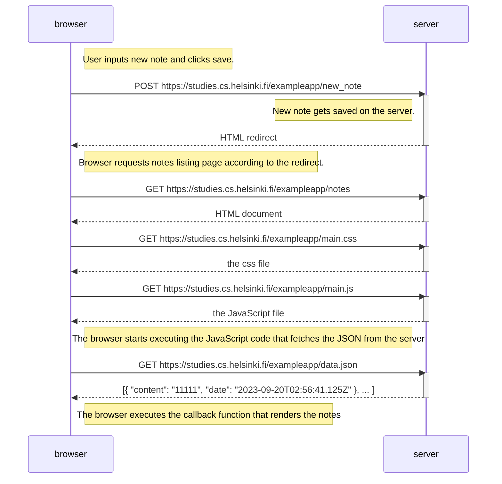

```mermaid
sequenceDiagram
    participant browser
    participant server

    Note right of browser: User inputs new note and clicks save.

    browser->>server: POST https://studies.cs.helsinki.fi/exampleapp/new_note
    activate server

    Note left of server: New note gets saved on the server.

    server-->>browser: HTML redirect
    deactivate server

    Note right of browser: Browser requests notes listing page according to the redirect.

    browser->>server: GET https://studies.cs.helsinki.fi/exampleapp/notes
    activate server
    server-->>browser: HTML document
    deactivate server

    browser->>server: GET https://studies.cs.helsinki.fi/exampleapp/main.css
    activate server
    server-->>browser: the css file
    deactivate server

    browser->>server: GET https://studies.cs.helsinki.fi/exampleapp/main.js
    activate server
    server-->>browser: the JavaScript file
    deactivate server

    Note right of browser: The browser starts executing the JavaScript code that fetches the JSON from the server

    browser->>server: GET https://studies.cs.helsinki.fi/exampleapp/data.json
    activate server
    server-->>browser: [{ "content": "11111", "date": "2023-09-20T02:56:41.125Z" }, ... ]
    deactivate server

    Note right of browser: The browser executes the callback function that renders the notes
```
