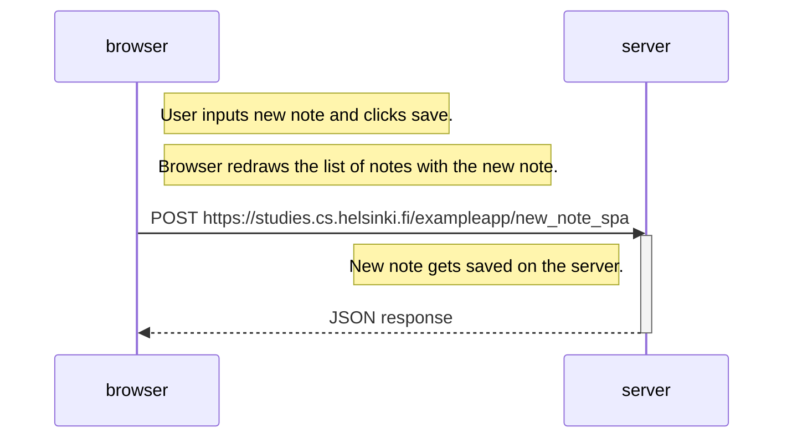

```mermaid
sequenceDiagram
    participant browser
    participant server

    Note right of browser: User inputs new note and clicks save.

    Note right of browser: Browser redraws the list of notes with the new note.

    browser->>server: POST https://studies.cs.helsinki.fi/exampleapp/new_note_spa
    activate server

    Note left of server: New note gets saved on the server.

    server-->>browser: JSON response
    deactivate server
```
